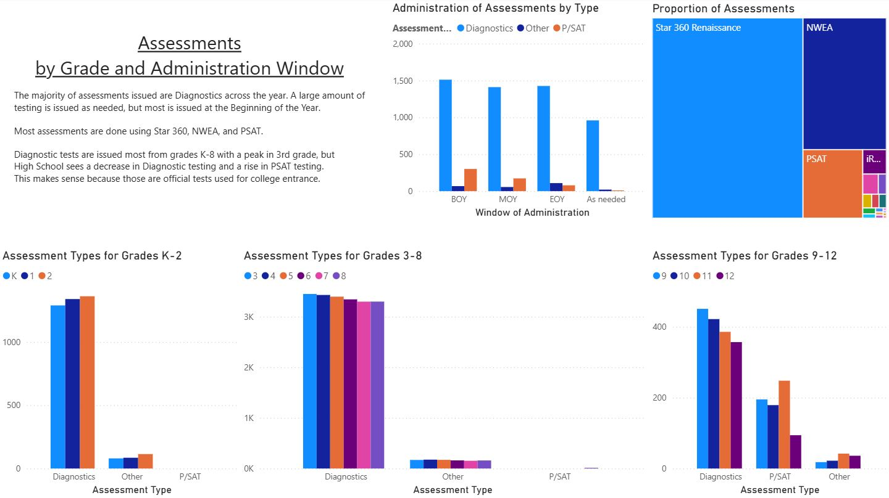
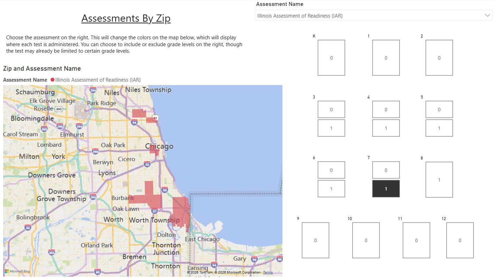

# Chicago Public Schools Assessment Dashboard

This project is an interactive Power BI dashboard designed to explore assessment administration across Chicago Public Schools (CPS).

Using publicly available CPS assessment data, the dashboard allows users to examine when, where, and how different assessments are administered throughout the district. The goal was to transform a large public dataset into an interactive reporting tool that supports exploration by assessment type, grade level, school, and geographic location.

## Dashboard Features

- Executive summary of district-wide assessment administration
- Assessment distribution by type
- Assessment distribution across grade levels
- School-level assessment summaries
- Geographic analysis by Chicago ZIP code
- Interactive filtering and drill-down throughout the dashboard

## Dashboard Preview

### Executive Summary

The summary dashboard provides a high-level overview of assessment administration across Chicago Public Schools, including assessment type distributions and grade-level trends.

### Geographic Analysis

The geographic dashboard displays assessment activity by Chicago ZIP code. Users can narrow the analysis to specific areas of the city and identify the schools within each ZIP code, making it easier to compare assessment patterns across neighborhoods.

## Technologies

- Power BI
- Power Query
- Microsoft Excel
- Data Visualization

## Skills Demonstrated

- Dashboard Design
- Interactive Reporting
- Data Cleaning
- Geographic Visualization
- Educational Analytics

## Data Source

Chicago Public Schools Open Data Portal

## Repository Contents

- `.pbix` Power BI dashboard
- Dashboard screenshots
- Project documentation
